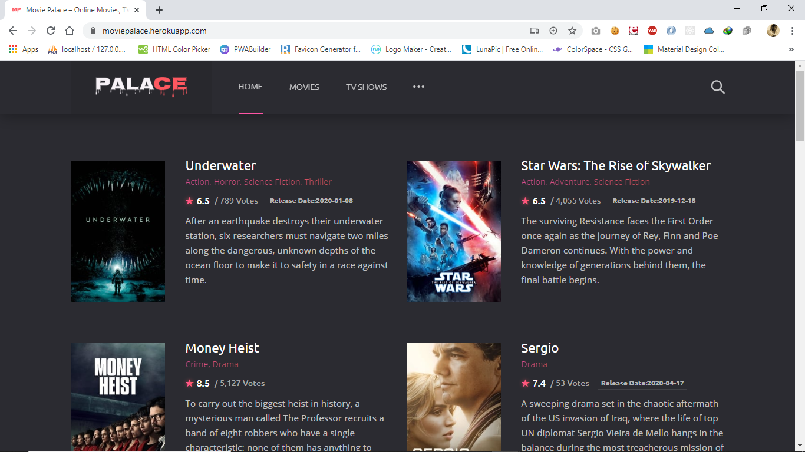
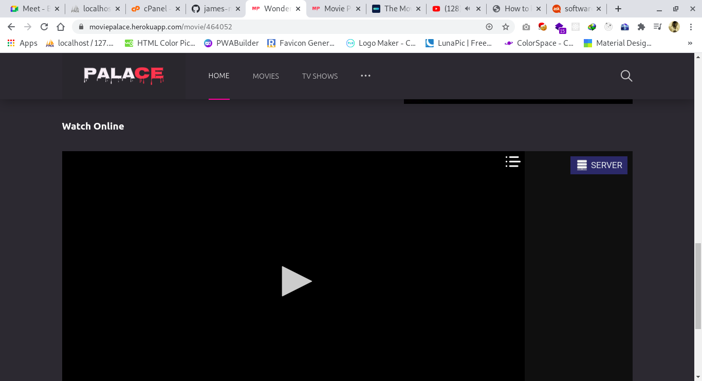
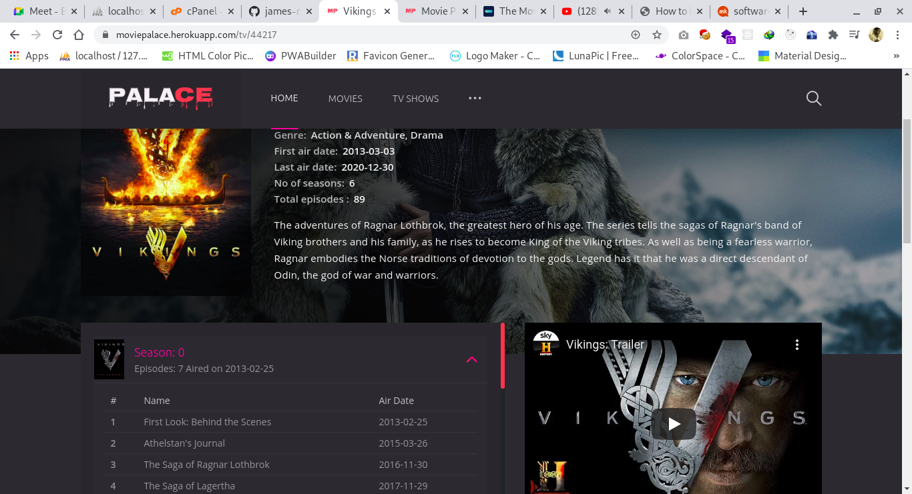

[](https://david-dm.org/james-muriithi/movie-palace) [](https://moviepalace.herokuapp.com/)

# Movie Palace
### [Demo](https://moviepalace.herokuapp.com/)
## Screenshots
### Home

### Streaming Movies

### Tv Shows Episodes


## Setup 
1. Clone this repository:

    ```bash
    git clone https://github.com/james-muriithi/movie-palace.git
    ```
2. Install Node.js dependencies:

    ```bash
    npm install
    ```

3. Set your api key environment variable. If you don't have the api key get one from [themoviedb](https://themoviedb.org/)
   ```bash
   export API_KEY=your_api_key
    ```
    or
    ```bash
   cp .env.example .env
    ```
4. Build
    ```bash
    npm run build
    ```
5. Run
    ```bash
    npm start


---

## Attribution

This application uses the TMDb API but is not endorsed or certified by TMDb.

<a href="https://www.themoviedb.org/about"></a>

---